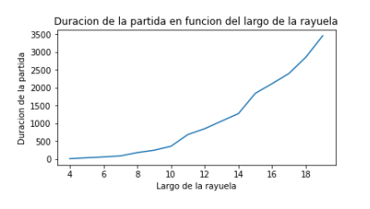
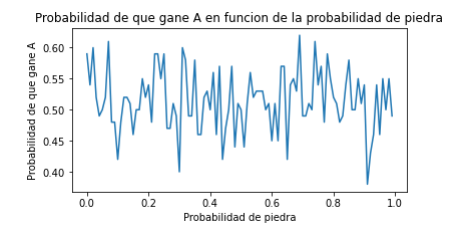
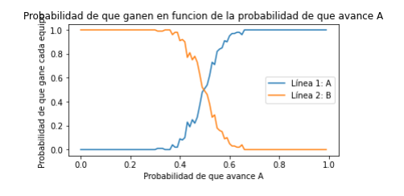

# Simulación Probabilística: Rayuela Mortal 🎲

Este repositorio contiene el Trabajo Práctico Final desarrollado para la materia Pensamiento Computacional de la Facultad de Ciencias Exactas y Naturales (UBA). 

El objetivo principal del proyecto fue modelar matemáticamente y simular en Python un juego llamado "Rayuela Mortal" para analizar cómo distintas variables aleatorias afectan el desarrollo, la duración y el resultado de las partidas.

## 📋 Reglas del modelo
El sistema simula un enfrentamiento con las siguientes condiciones:
* Dos equipos (A y B) inician en los extremos opuestos de un camino (representado por una lista).
* Ambos equipos avanzan casillero por casillero hasta encontrarse.
* Al chocar, el conflicto se resuelve mediante una partida de Piedra, Papel o Tijera.
* El ganador del duelo sigue avanzando, mientras que el perdedor es penalizado y debe volver a su punto de partida original.
* El juego termina cuando uno de los equipos logra llegar a la anteúltima posición del extremo contrario.

## 🛠️ Tecnologías utilizadas
* **Python**: Lógica algorítmica, funciones, ciclos y manejo de probabilidades con la librería `random`.
* **Matplotlib (`pyplot`)**: Generación de gráficos para el análisis exploratorio de los datos simulados.

## 📊 Análisis y Visualizaciones

A partir del modelo base, planteamos tres hipótesis distintas y realizamos múltiples simulaciones iterativas para responderlas:

### 1. ¿Cómo afecta el largo del tablero a la duración de la partida?
Simulamos partidas incrementando el tamaño de la pista. Los datos demostraron que a medida que el largo del camino aumenta, la duración de la partida (medida en cantidad de turnos) crece de manera exponencial.

)

### 2. ¿Qué pasa si un equipo usa una estrategia sesgada?
Modificamos las probabilidades de la función de Piedra, Papel o Tijera para que el equipo A elija "Piedra" con mayor frecuencia. La simulación demostró que esta estrategia no altera sus posibilidades de ganar; el resultado del juego sigue tendiendo a la aleatoriedad perfecta (50/50).

### 3. ¿Cómo impacta la velocidad de avance en la victoria?
Alteramos el ritmo de los jugadores, dándole a un equipo mayor probabilidad de avanzar casilleros por turno que al otro. El análisis gráfico mostró una clara correlación: a medida que la probabilidad de avanzar aumenta, las posibilidades de victoria crecen drásticamente. El único punto de equidad se encuentra cuando ambos tienen exactamente 0.5 de probabilidad de moverse.

## 👥 Autores
Proyecto desarrollado en conjunto por:
* Joaquín Bustamante
* Lisa Muñoz
